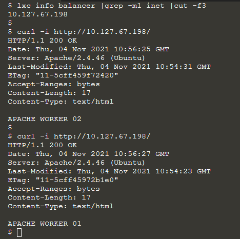

# Apache proxy and balance

In this script we create three linux container with ubuntu and apache2.

	+---------------+---------+----------------------+-----------------------------------------------+------------+-----------+
	|     NAME      |  STATE  |         IPV4         |                     IPV6                      |    TYPE    | SNAPSHOTS |
	+---------------+---------+----------------------+-----------------------------------------------+------------+-----------+
	| apache-wrk-01 | RUNNING | 10.127.67.109 (eth0) | fd2f:bc5d:4ba2:8ac5:216:3eff:fe09:21f5 (eth0) | PERSISTENT | 0         |
	+---------------+---------+----------------------+-----------------------------------------------+------------+-----------+
	| apache-wrk-02 | RUNNING | 10.127.67.94 (eth0)  | fd2f:bc5d:4ba2:8ac5:216:3eff:fe6f:6bc1 (eth0) | PERSISTENT | 0         |
	+---------------+---------+----------------------+-----------------------------------------------+------------+-----------+
	| balancer      | RUNNING | 10.127.67.198 (eth0) | fd2f:bc5d:4ba2:8ac5:216:3eff:fe01:84b1 (eth0) | PERSISTENT | 0         |
	+---------------+---------+----------------------+-----------------------------------------------+------------+-----------+

We want the balancer container to redirect all the traffic on http to the other two workers.
I will use the root path / as a forward proxy to our balancer cluster.
Then standard [byrequests](https://httpd.apache.org/docs/2.4/mod/mod_lbmethod_byrequests.html) balancing method will be used for switching the requests (round-robin).


```sh
apt update; apt -y install lxc lxd && lxd init

lxc launch images:ubuntu/21.04 balancer -c limits.cpu=1
lxc exec balancer -- sh -c "apt update; apt install -y apache2 && systemctl enable --now apache2"
lxc copy balancer apache-wrk-01
lxc copy balancer apache-wrk-02

lxc start apache-wrk-01 apache-wrk-02
APACHE_01=$(lxc info apache-wrk-01 |grep -m1 inet |cut -f3)
APACHE_02=$(lxc info apache-wrk-02 |grep -m1 inet |cut -f3)
 
lxc exec balancer -- sh -c "echo ${APACHE_01} apache-wrk-01 >>/etc/hosts"
lxc exec balancer -- ping apache-wrk-01
lxc exec balancer -- sh -c "echo ${APACHE_02} apache-wrk-02 >>/etc/hosts"

lxc exec balancer -- bash
cd /etc/apache2/mods-available
a2enmod proxy proxy_balancer proxy_http lbmethod_byrequests status

root@balancer:/etc/apache2# cat mods-enabled/proxy.conf 
<IfModule mod_proxy.c>
        ProxyRequests On
        ProxyPass "/" "balancer://mycluster"
        <Proxy "balancer://mycluster">
                BalancerMember "http://apache-wrk-01:80"
                BalancerMember "http://apache-wrk-02:80"
        </Proxy>
</IfModule>

apachectl configtest
systemctl restart apache2
exit

lxc exec balancer -- sh -c "echo 'THIS IS THE LOAD BALANCER' >/var/www/html/index.html"
$ lxc exec apache-wrk-01 -- sh -c "echo 'APACHE WORKER 01' >/var/www/html/index.html"
$ lxc exec apache-wrk-02 -- sh -c "echo 'APACHE WORKER 02' >/var/www/html/index.html"

BALANCER_IP=$(lxc info balancer |grep -m1 inet |cut -f3)

for i in $(seq 1 5); do curl -i http://${BALANCER_IP}/; done
```



## References
- https://httpd.apache.org/docs/2.4/mod/mod_proxy_balancer.html
- https://httpd.apache.org/docs/2.4/mod/mod_proxy.html#proxypass

