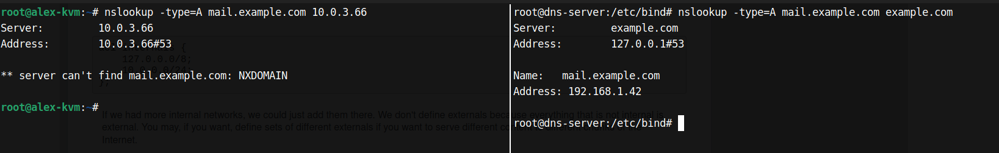

## Serving different contents to the internal and external network

cat /etc/bind/named.conf.local 

    acl internals {
        127.0.0.0/24;
        10.0.3.66/32;
    };

cat /etc/bind/named.conf.default-zones 

    #zone "example.com." {
    #	type master;
    #	file "/etc/bind/example.com";
    #};

    view "internals" {
        match-clients { "internals"; };
        zone "example.com." {
            type master;
            file "/etc/bind/example.com.internals";
        };

        // prime the server with knowledge of the root servers
        zone "." {
            type hint;
            file "/usr/share/dns/root.hints";
        };

        // be authoritative for the localhost forward and reverse zones, and for
        // broadcast zones as per RFC 1912

        zone "localhost" {
            type master;
            file "/etc/bind/db.local";
        };

        zone "127.in-addr.arpa" {
            type master;
            file "/etc/bind/db.127";
        };

        zone "0.in-addr.arpa" {
            type master;
            file "/etc/bind/db.0";
        };

        zone "255.in-addr.arpa" {
            type master;
            file "/etc/bind/db.255";
        };
    };

    view "externals" {
    match-clients { any; };
        zone example.com. {
            type master;
            file "/etc/bind/example.com";
        };
    };

`cat /etc/bind/example.com.internals `

    ;
    ; BIND data file for local loopback interface
    ;
    $TTL	604800
    @	IN	SOA	ns.example.com. root.localhost. (
                    22		; Serial
                604800		; Refresh
                86400		; Retry
                2419200		; Expire
                604800 )	; Negative Cache TTL
    ;
    @	IN	NS	ns.example.com.
    @	IN	A	192.168.1.66
    @	IN	AAAA	::1
    ns	IN	A 	192.168.1.67
    mail   	IN 	A 	192.168.1.42
    mail 	IN 	MX 	10 mail

`# cat /etc/bind/example.com`

    ;
    ; BIND data file for local loopback interface
    ;
    $TTL	604800
    @	IN	SOA	ns.example.com. root.localhost. (
                    22		; Serial
                604800		; Refresh
                86400		; Retry
                2419200		; Expire
                604800 )	; Negative Cache TTL
    ;
    @	IN	NS	ns.example.com.
    @	IN	A	10.0.3.66
    @	IN	AAAA	::1
    ns	IN	A 	10.0.3.66

`systemctl restart named`  

`named-checkconf -x`

    named-checkconf -z
    zone example.com/IN: loaded serial 22
    zone localhost/IN: loaded serial 2
    zone 127.in-addr.arpa/IN: loaded serial 1
    zone 0.in-addr.arpa/IN: loaded serial 1
    zone 255.in-addr.arpa/IN: loaded serial 1
    zone example.com/IN: loaded serial 22

On the left the VM host from where we can't see the address of the mail server, since it is defined only in the "internal" view.

## Resources
- https://www.howtoforge.com/two_in_one_dns_bind9_views#SECTION00040000000000000000